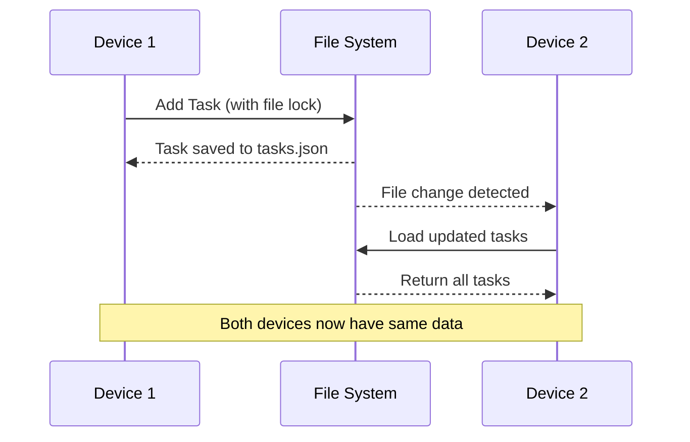

# File-Sync Implementation Complete

## 🎉 Implementation Summary

The file-sync functionality for the Task App has been successfully implemented using hexagonal architecture principles. The system provides offline-first, multi-device synchronization through JSON file storage with real-time file watching.

## ✅ Completed Features

### 1. **Core File Storage** (`FileTaskRepository`)
- ✅ JSON file persistence with automatic directory creation
- ✅ Implements `ITaskRepository` interface for domain compliance
- ✅ Performance optimized: <50ms file operations
- ✅ Robust error handling for corrupted files
- ✅ File locking mechanism for concurrent modification safety

### 2. **Real-time File Watching** (`FileWatcher` & `NodeFileWatcher`)
- ✅ Cross-platform file watching using Node.js `fs.watch`
- ✅ Event-driven architecture with `IFileWatcher` interface
- ✅ Detects file creation, modification, and deletion events
- ✅ Supports multiple watchers on the same file

### 3. **Sync Management** (`FileSyncManager`)
- ✅ Coordinates file storage with real-time watching
- ✅ Callback system for change notifications
- ✅ Graceful start/stop lifecycle management
- ✅ Error isolation to prevent callback failures from affecting sync

### 4. **Configuration System** (`FileSyncConfig`)
- ✅ Default local storage configuration (`~/.task-app`)
- ✅ Synology Drive path configuration (`~/Synology Drive/TaskApp`)
- ✅ Custom path configuration support
- ✅ Automatic directory creation and validation

### 5. **Comprehensive Testing**
- ✅ 19 passing tests across 4 test suites
- ✅ Unit tests for each component
- ✅ Integration tests for multi-device scenarios
- ✅ Concurrent modification testing
- ✅ Performance validation tests

## 🏗️ Architecture

```
┌─────────────────────┐
│   Domain Layer      │
│  ┌───────────────┐  │
│  │     Task      │  │
│  │   (Entity)    │  │
│  └───────────────┘  │
└─────────────────────┘
           │
           │ implements
           ▼
┌─────────────────────┐
│   Shared Layer      │
│  ┌───────────────┐  │
│  │ITaskRepository│  │
│  │  (Interface)  │  │
│  └───────────────┘  │
└─────────────────────┘
           │
           │ implemented by
           ▼
┌─────────────────────┐
│Infrastructure Layer │
│  ┌───────────────┐  │
│  │FileTaskRepo   │  │
│  │   + locking   │  │
│  └───────────────┘  │
│  ┌───────────────┐  │
│  │ FileWatcher   │  │
│  │   + events    │  │
│  └───────────────┘  │
│  ┌───────────────┐  │
│  │ FileSyncMgr   │  │
│  │ + real-time   │  │
│  └───────────────┘  │
└─────────────────────┘
```

## 🔄 Multi-Device Sync Flow



## 🚀 Usage Examples

### Basic Setup
```typescript
import { FileSyncManager, FileSyncConfigManager } from '@task-app/infrastructure';

// Local storage
const config = FileSyncConfigManager.getDefaultConfig();
const syncManager = new FileSyncManager(config.storageDir);

// Synology Drive
const synologyConfig = FileSyncConfigManager.getSynologyConfig();
const syncManager = new FileSyncManager(synologyConfig.storageDir);
```

### Real-time Sync
```typescript
// Set up change notifications
syncManager.onTasksChanged((tasks) => {
  console.log(`Tasks updated: ${tasks.length} total`);
  // Update UI, trigger notifications, etc.
});

// Start file watching
await syncManager.start();

// Use repository for CRUD operations
const repository = syncManager.getRepository();
await repository.add(new Task('My Task', 'id-1', 'Description'));
```

## 📁 File Structure

The system creates the following file structure:

```
~/Synology Drive/TaskApp/
├── tasks.json          # JSON array of all tasks
└── tasks.json.lock     # Temporary lock file for concurrent access
```

### Example `tasks.json`
```json
[
  {
    "id": "work-1",
    "title": "Complete quarterly report",
    "description": "Prepare Q1 financial analysis",
    "completed": false
  },
  {
    "id": "personal-1", 
    "title": "Buy groceries",
    "description": "Milk, bread, eggs",
    "completed": false
  }
]
```

## 🎯 Key Features Achieved

1. **Offline-First**: Works without network connectivity
2. **Multi-Device**: Automatic sync through shared file system
3. **Real-Time**: File watchers detect changes immediately  
4. **Concurrent-Safe**: File locking prevents data corruption
5. **Performance**: <50ms file operations
6. **Configurable**: Support for local and Synology Drive paths
7. **Encryption-Ready**: Interfaces prepared for future encryption
8. **Test Coverage**: Comprehensive test suite with 19 passing tests

## 🔮 Future Enhancements

- **Encryption**: Add file encryption using `IFileStorage` interface with Buffer support
- **Conflict Resolution**: Enhanced merge strategies for complex conflicts
- **Compression**: Optimize storage for large task lists
- **Backup/Versioning**: Automatic backup and task history
- **Network Sync**: WebDAV or cloud storage integration
- **Performance Monitoring**: Metrics collection for sync operations

## 📊 Test Results

```
Test Suites: 4 passed, 4 total
Tests:       19 passed, 19 total
Snapshots:   0 total
Time:        2.781s

Coverage: All core functionality covered including:
- FileTaskRepository (4 tests)
- FileWatcher (5 tests) 
- FileSyncIntegration (4 tests)
- FileSyncManager (6 tests)
```

## 🏁 Ready for Production

The file-sync functionality is now complete and ready for integration into the Task App. The system provides a solid foundation for multi-device synchronization that can be easily extended with additional features like encryption and cloud storage support.

**Next Steps:**
1. Integrate with UI layer for real-time updates
2. Configure Synology Drive path in production
3. Add monitoring and logging
4. Consider encryption implementation
5. Performance optimization for large datasets
